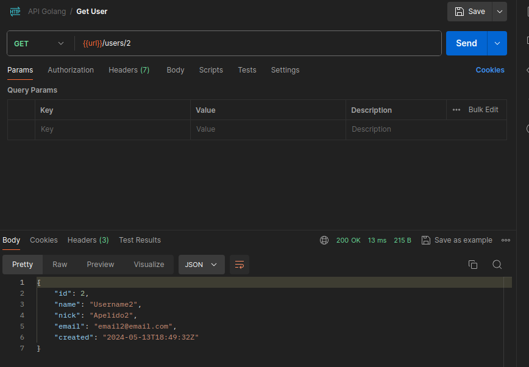
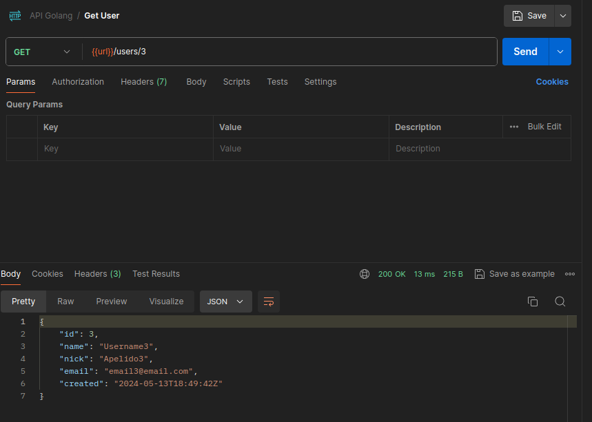

# API1:2023 Broken Object Level Authorization

*Object level authorization* é um mecanismo de controle de acesso que geralmente é implementado em nível de código para validar que um usuário só pode acessar os objetos aos quais deveria ter permissão para acessar.

Cada *endpoint* de API que recebe um ID de um objeto e executa qualquer ação no objeto deve implementar verificações de autorização em nível de objeto. As verificações devem validar se o usuário logado possui permissões para executar a ação solicitada no objeto solicitado.

Falhas neste mecanismo normalmente levam à divulgação não autorizada de informações, modificação ou destruição de todos os dados.

# Exploração

Um *token* JWT pode ser utilizado para uma série de fatores que envolvem autenticidade e identidade. É muito comum em ambientes de produção, encontrarmos casos em que somente a autenticidade é verificada, checando a validade do *token*, porém a identidade do usuário não.

Isso pode levar ao vazamento de informações através de acesso a objetos pertencentes a outros usuários.

Nesta API em específico, após afetuar o login com um usuário qualquer, supomos que seja o usuário de **Id 1**, recebemos um *token* que prova a autenticidade de sua sessão, porém não há nada no código-fonte que valide sua identidade. Neste caso, ao acessar o *endpoint* `/users/:userId` e inserir qualquer Id, é possível acessar dados de cadastro de outros usuários.

As imagens abaixo, mostram uma sessão com o usuário 1, acessando dados de outros usuários.





## Impacto Técnico

Uma vez que um invasor consiga acessar recursos e dados não permitidos em seu escopo de autorização, ele pode comprometer a confidencialidade, e integridade do sistema.

## Impacto de Negócio

Ao acessar informações e funcionalidades não permitidos em seu escopo de autorização, um invasor pode comprometer de forma crítica a imagem da empresa ao modificar, extrair ou divulgar estes dados. Além de possíveis sanções com órgãos reguladores como a LGPD.

## Recomendação de Correção

- Implemente um mecanismo de autorização adequado que dependa das políticas e da hierarquia do usuário.
- Use o mecanismo de autorização para verificar se o usuário logado tem acesso para executar a ação solicitada no registro em todas as funções que usam uma entrada do cliente para acessar um registro no banco de dados.
- Prefira o uso de valores aleatórios e imprevisíveis como GUIDs para IDs de registros.

## Sugestão de Correção no Código

No script `src/authentication/token.go` temos o código responsável pela geração do *token* de acesso do usuário quando se autentica. Podemos ver que a função `CreateToken()` recebe o `userId` e o insere nas *claims* do JWT. Isso significa que a identidade do usuário já existe no *token*, mas ainda não está sendo validada.

Podemos criar uma função dentro deste mesmo script, que extrai esta informação de um token recebido em um *request* e o retorna:

```go
func ExtractUserId(r *http.Request) (uint64, error) {
	tokenString := extractToken(r)
	token, err := jwt.Parse(tokenString, returnVerificationKey)
	if err != nil {
		return 0, err
	}

	if permissions, ok := token.Claims.(jwt.MapClaims); ok && token.Valid {
		userId, err := strconv.ParseUint(fmt.Sprintf("%.0f", permissions["userId"]), 10, 64)
		if err != nil {
			return 0, err
		}

		return userId, nil
	}

	return 0, errors.New("Token inválido")
}
```

Em seguida, podemos ir até o pacote `controllers` responsável por lidar com as requisições, e, para cada função que exija a validação de identidade, podemos invocar a função que criamos, e comparar seu retorno com o **Id** sendo manipulado no *request*.

```go
	// Validacao de user id jwt
	tokenUserId, err := authentication.ExtractUserId(r)
	if err != nil {
		responses.Err(w, http.StatusUnauthorized, err)
		return
	}

	if userID != tokenUserId {
		responses.Err(w, http.StatusForbidden, errors.New("não é possível atualizar um usuário que não seja o seu"))
		return
	}
```

Esta é uma solução simples, e de fácil implementação, porém pode não ser a ideal para todos os casos. É recomendado que novas implementações mais robustas sejam desenvolvidas e implementadas.