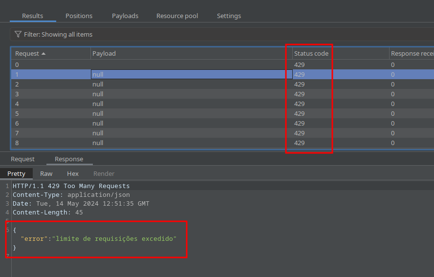

# API4:2023 Unrestricted Resource Consumption

Satisfazer solicitações de API requer recursos como largura de banda de rede, CPU, memória e armazenamento. Às vezes, os recursos necessários são disponibilizados pelos provedores de serviços por meio de integrações de API e pagos por solicitação, como envio de e-mails/SMS/chamadas telefônicas, validação biométrica, etc.

Uma API é vulnerável se pelo menos um dos seguintes limites estiver ausente ou definido de forma inadequada (por exemplo, muito baixo/alto):

- Tempos limite de execução.
- Memória máxima alocável.
- Número máximo de descritores de arquivo.
- Número máximo de processos.
- Tamanho máximo do arquivo para upload.
- Número de operações a serem executadas em uma única solicitação de cliente de API (por exemplo, lote GraphQL).
- Número de registros por página a serem retornados em uma única solicitação-resposta.
- Limite de gastos de prestadores de serviços terceirizados.

# Exploração

Caso um usuário precise recuperar a sua senha por algum motivo, a API possui o *endpoint* `/forgot-pass` que recebe um e-mail no *body*, caso este e-mail exista na base de dados, a API chama (de forma ficticia) um serviço de envio de e-mail de recuperação de senha.

Porém, não existe nenhum controle no *back-end* que faça o controle da taxa de solicitações deste *endpoint*. um atacante pode se aproveitar desta vulnerabilidade, para enviar centenas de milhares de requisições para este *endpoint* podendo causar uma seérie de danos, como:

- Consumo irrestrito de recursos computacionais.
- *Flood attack* de e-mails em usuários legítimos da aplicação.
- Causar queda ou indisponibilidade do serviço para usuários legítimos.

## Impacto Técnico

A ausência de *rate-limit* pode causar impactos técnicos significativos em uma aplicação ou sistema, incluindo:

- **Sobrecarga do sistema**: Sem *rate-limit*, um único usuário ou sistema pode enviar uma grande quantidade de solicitações em um curto período de tempo, causando sobrecarga nos recursos do sistema, como CPU, memória e banda de rede. Isso pode levar a falhas no sistema, tempos de resposta mais longos para outros usuários e desperdício de recursos.
- **Ataques DDoS**: A falta de *rate-limit* torna o sistema vulnerável a ataques DDoS (*Distributed Denial of Service*), onde um atacante envia uma grande quantidade de solicitações para sobrecarregar o sistema e torná-lo inacessível para os usuários legítimos.
- **Limitação de recursos**: Sem *rate-limit*, os usuários podem usar recursos desnecessariamente, o que pode resultar em desperdício de recursos e custos adicionais para o provedor de serviços.
- **Violação da privacidade**: Sem *rate-limit*, os usuários podem enviar solicitações em massa para acessar informações confidenciais, violando a privacidade dos usuários.
- **Impacto na escalabilidade**: Sem *rate-limit*, a aplicação não será capaz de lidar com um aumento repentino de tráfego, resultando em problemas de performance, e pode ser necessário aumentar recursos para garantir a estabilidade do sistema.


## Impacto de Negócio

A ausência de *rate-limit* pode causar impactos de negócio significativos, incluindo:

- **Perda de confiança do cliente**: Se o sistema for sobrecarregado ou inacessível devido à falta de *rate-limit*, os clientes podem perder confiança na sua capacidade de fornecer um serviço confiável e estável. Isso pode resultar em perda de clientes e diminuição das receitas.
- **Custos adicionais**: Sem *rate-limit*, os recursos do sistema podem ser usados ​​desnecessariamente, o que pode resultar em custos adicionais para o provedor de serviços. Além disso, a falta de *rate-limit* pode tornar o sistema vulnerável a ataques DDoS, o que pode resultar em custos adicionais para mitigar esses ataques.
- **Impacto na reputação**: Se o sistema for inacessível devido à falta de *rate-limit*, isso pode prejudicar a reputação da empresa e a imagem dela perante seus clientes e parceiros.
- **Problemas de conformidade**: Se a aplicação ou sistema não tem *rate-limit*, pode violar regulamentos e leis de privacidade, o que pode resultar em sanções financeiras e danos à reputação.

## Recomendação de Correção

- Use uma solução que facilite a limitação de memória , CPU , número de reinicializações , descritores de arquivos e processos como contêineres/código sem servidor (por exemplo, Lambdas).
- Defina e imponha um tamanho máximo de dados em todos os parâmetros e cargas recebidas, como comprimento máximo para strings, número máximo de elementos em matrizes e tamanho máximo do arquivo de upload (independentemente de estar armazenado localmente ou em armazenamento em nuvem).
- Implemente um limite de frequência com que um cliente pode interagir com a API dentro de um período definido (limitação de taxa).
- A limitação de taxa deve ser ajustada com base nas necessidades do negócio. Alguns endpoints de API podem exigir políticas mais rígidas.
- Limitar quantas vezes ou com que frequência um único cliente/usuário de API pode executar uma única operação (por exemplo, validar uma OTP ou solicitar recuperação de senha sem visitar o URL único).
- Adicione validação adequada no lado do servidor para string de consulta e parâmetros do corpo da solicitação, especificamente aquele que controla o número de registros a serem retornados na resposta.
- Configure limites de gastos para todos os provedores de serviços/integrações de API. Quando não for possível definir limites de gastos, os alertas de cobrança deverão ser configurados.

## Sugestão de Correção no Código

Existem várias bibliotecas prontas em Go que fornecem soluções robustas de *rate-limit*, porém, para fins de entendimento do processo, esta sugestão de correção criará uma solução do zero utilizando a técnica ***Token Bucket*** descrita no [material auxiliar](https://github.com/h41stur/devsec-api/tree/main/docs/base/Rate-Limit#rate-limiting).

O código abaixo será bem comentado para que a implementação fique de forma mais clara. Primeiramente, criaremos o script `src/middlewares/rate-limit.go` que conterá toda a lógica do ***Token Bucket***:

```go
package middlewares

import (
	"net/http"
	"strings"
	"sync"
	"time"
)

var (
	limit = 5.0 // Máximo de tokens no bucket
	rate  = 1.0 // Taxa de recarga de 1 token por segundo
)

// TokenBucket estrutura para controlar o rate limiting de um IP
type TokenBucket struct {
	capacity  float64   // capacidade máxima do bucket
	remaining float64   // tokens restantes no bucket
	rate      float64   // taxa de recarga por segundo
	lastCheck time.Time // ultima vez que o bucket foi checado
	mu        sync.Mutex // Mutex para garantir acesso seguro e sincronizado ao bucket entre várias goroutines
}

// RateLimiter estrutura para armazenar os baldes de todos os IPs
type RateLimiter struct {
	buckets map[string]*TokenBucket // Mapa que associa cada IP a seu respectivo Token Bucket
	limit   float64 // Limite de tokens máximo para cada bucket
	rate    float64 // Taxa de recarga de tokens para cada bucket
	mu      sync.Mutex // Mutex para controlar o acesso ao mapa de bucket
}

// NewTokenBucket cria um novo Token Bucket
func NewTokenBucket(capacity, rate float64) *TokenBucket {
	return &TokenBucket{
		capacity:  capacity, // Inicializa a capacidade do bucket
		remaining: capacity, // Inicializa o bucket com a capacidade total, ou seja, bucket cheio
		rate:      rate, // Define a taxa de recarga de tokens
		lastCheck: time.Now(), // Marca o momento da criação como a última verificação
	}
}

// Allow verifica se uma requisição pode ser permitida e atualiza o estado do bucket
func (tb *TokenBucket) Allow() bool {
	tb.mu.Lock() // Bloqueia o acesso ao bucket para garantir operação atômica
	defer tb.mu.Unlock() // Garante que o mutex será liberado ao final do método

	now := time.Now() // Captura o momento atual para calcular o tempo decorrido

	// Calcula quantos tokens devem ser adicionados desde a última verificação
	elapsed := now.Sub(tb.lastCheck).Seconds()
	tb.remaining += elapsed * tb.rate // Adiciona novos tokens de acordo com a taxa de recarga
	if tb.remaining > tb.capacity {
		tb.remaining = tb.capacity // O bucket não pode ter mais tokens que sua capacidade
	}

	tb.lastCheck = now // Atualiza o momento da última verificação

	if tb.remaining >= 1 { // Se houver pelo menos 1 token disponível
		tb.remaining -= 1 // Consome um token
		return true // Permite a requisição
	}

	return false // Se não houver tokens disponíveis, recusa a requisição
}

// NewRateLimiter inicializa o RateLimiter
func NewRateLimiter() *RateLimiter {
	return &RateLimiter{
		buckets: make(map[string]*TokenBucket), // Inicializa o mapa de buckets vazio
		limit:   limit, // Define o limite máximo de tokens para os buckets
		rate:    rate, // Define a taxa de recarga para os buckets
	}
}

// extractIP extrai o endereço IP de um http.Request
func extractIP(r *http.Request) string {
	ip := r.RemoteAddr
	if idx := strings.LastIndex(ip, ":"); idx != -1 {
		ip = ip[:idx]
	}
	return ip
}
```

Em seguida, podemos ir ao script `src/middlewares/middlewares.go` e implementar a função que chamará a lógica:

```go
func (rl *RateLimiter) RateLimit(next http.HandlerFunc) http.HandlerFunc {
	return func(w http.ResponseWriter, r *http.Request) {
		ip := extractIP(r) // Extrai o endereço IP do cliente a partir do request

		rl.mu.Lock() // Bloqueia o acesso ao mapa de buckets para garantir operação atômica
		bucket, exists := rl.buckets[ip] // Busca o bucket associado ao IP do cliente
		if !exists { // Se não existir um bucket para esse IP
			bucket = NewTokenBucket(rl.limit, rl.rate) // Cria um novo bucket para o IP
			rl.buckets[ip] = bucket // Armazena o bucket no mapa
		}
		rl.mu.Unlock() // Libera o acesso ao mapa de buckets

		if !bucket.Allow() { // Usa o bucket para verificar se a requisição deve ser permitida
			responses.Err(w, http.StatusTooManyRequests, errors.New("limite de requisições excedido")) // Se não for permitida, retorna erro 429
			return
		}

		next(w, r) // Se for permitida, passa o controle para o próximo handler na cadeia
	}
}
```

por ultimo, como podemos encadear quantos *middlewares* forem necessários, vamos no script `src/router/route/route.go` e vamos encadeá-lo nos *handlers* dos *requests* na função `RouteConfig()` da seguinte forma:

```go
func RouteConfig(r *mux.Router) *mux.Router {
	routes := usersRoute
	for _, route := range loginRoute {
		routes = append(routes, route)
	}

	for _, route := range routes {

		if route.AuthRequired {
			r.HandleFunc(route.URI, middlewares.NewRateLimiter().RateLimit(
				middlewares.Logger(
					middlewares.Authenticate(route.Function),
					),
				),
			).Methods(route.Method)
		} else {
			r.HandleFunc(route.URI, middlewares.NewRateLimiter().RateLimit(
				middlewares.Logger(route.Function),
				)).Methods(route.Method)
		}
	}

	return r
}
```

A imagem abaixo, simula um ataque onde **100** requisições são feitas para o *endpoint* de recuperação de senha, note que estão retornando com **Status 429** como esperado:



Esta é uma solução simples, e de fácil implementação, porém pode não ser a ideal para todos os casos. É recomendado que novas implementações mais robustas sejam desenvolvidas e implementadas.


