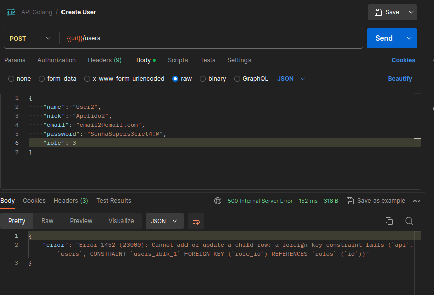
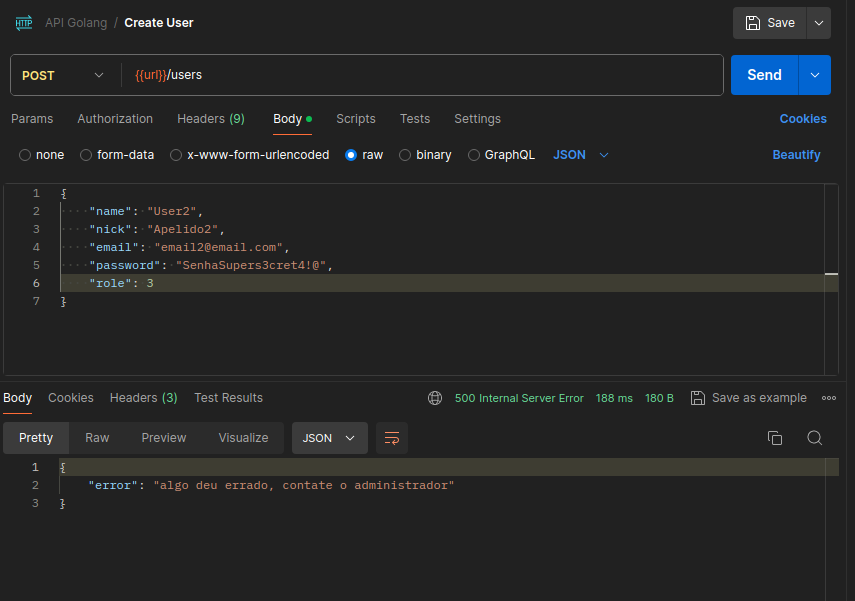

# API8:2023 Security Misconfiguration

A API pode estar vulnerável se:

- O reforço de segurança apropriado está faltando em qualquer parte da pilha de API ou se houver permissões configuradas incorretamente em serviços de nuvem.
- Os *patches* de segurança mais recentes estão faltando ou os sistemas estão desatualizados.
- Recursos desnecessários estão habilitados (por exemplo, verbos HTTP, recursos de registro).
- Existem discrepâncias na forma como as solicitações recebidas são processadas pelos servidores na cadeia de servidores HTTP.
- Falta segurança da camada de transporte (TLS).
- As diretivas de segurança ou de controle de cache não são enviadas aos clientes.
- Uma política de compartilhamento de recursos entre origens (CORS) está ausente ou definida incorretamente.
- As mensagens de erro incluem rastreamentos de pilha ou expõem outras informações confidenciais.

# Exploração

Esta API foi desenvolvida para ter um bom tratamento de erros, mostrando de forma detalhada o erro correspondente em cada possível ponto que aconteça. Isso da uma visão muito ampla para os desenvolvedores, porém entrega informações valiosas para invasores, como versão de DBMS, erros em *querys*, erros em bibliotecas que expõem suas versões.

Por exemplo, se tentarmos criar um usuário com a *role* **3** que não existe no banco de dados, receberemos um erro que expõe muito sobre a estrutura do banco de dados:



## Impacto Técnico

- **Vulnerabilidades de segurança**: Se as informações confidenciais são expostas devido a falhas de segurança, isso pode tornar o sistema vulnerável a ataques cibernéticos, como roubo de identidade, invasão de privacidade e ataques de phishing.
- **Problemas de desempenho**: Se as informações confidenciais são expostas devido a um problema de desempenho, pode haver problemas de desempenho e disponibilidade do sistema.

## Impacto de Negócio

- **Perda de confiança do cliente**: A exposição não intencional ou não autorizada de informações confidenciais pode levar a perda de confiança dos clientes e parceiros comerciais, o que pode resultar em perda de clientes e diminuição das receitas.
- **Problemas de conformidade**: Se as informações confidenciais são expostas devido a falhas de segurança, isso pode violar regulamentos e leis de privacidade, como a LGPD, e resultar em sanções financeiras e danos à reputação.
- **Danos à reputação**: A exposição não intencional ou não autorizada de informações confidenciais pode prejudicar a reputação da empresa e a imagem dela perante seus clientes e parceiros.
- **Problemas legais**: a exposição não intencional ou não autorizada de informações confidenciais pode resultar em problemas legais, incluindo processos judiciais e ações coletivas.

## Recomendação de Correção

O ciclo de vida da API deve incluir:

- Um processo de proteção repetível que leva à implantação rápida e fácil de um ambiente devidamente bloqueado.
- Uma tarefa para revisar e atualizar configurações em toda a pilha de API. A revisão deve incluir: arquivos de orquestração, componentes de API e serviços em nuvem (por exemplo, permissões de bucket S3).
- Um processo automatizado para avaliar continuamente a eficácia da configuração e definições em todos os ambientes.

Além disso:

- Certifique-se de que todas as comunicações de API do cliente para o servidor de API e quaisquer componentes *downstream/upstream* ocorram por meio de um canal de comunicação criptografado (TLS), independentemente de ser uma API interna ou voltada ao público.
- Seja específico sobre quais verbos HTTP cada API pode ser acessada: todos os outros verbos HTTP devem ser desabilitados (por exemplo, HEAD).
- APIs que esperam ser acessadas a partir de clientes baseados em navegador (por exemplo, front-end de WebApp) devem, pelo menos:
    - implementar uma política adequada de compartilhamento de recursos entre origens (CORS).
    - inclua cabeçalhos de segurança aplicáveis
- Restrinja os tipos de conteúdo/formatos de dados recebidos àqueles que atendem aos requisitos comerciais/funcionais.
- Certifique-se de que todos os servidores na cadeia de servidores HTTP (por exemplo, balanceadores de carga, proxies reversos e de encaminhamento e servidores back-end) processem as solicitações recebidas de maneira uniforme para evitar problemas de dessincronização.
- Quando aplicável, defina e aplique todos os esquemas de carga útil de resposta da API, incluindo respostas de erro, para evitar que rastreios de exceção e outras informações valiosas sejam enviadas de volta aos invasores.

## Sugestão de Correção no Código

Para que possamos passar o mínimo de informações possíveis para o usuário final em caso de erro, sem que o excelente tratamento existente seja perdido, podemos criar o "modo *debug*" para a aplicação. Onde, quando está ligado, permanecemos com as respostas detalhadas, e quando desligados, retorna sempre uma resposta padrão para o usuário.

Para isso, podemos incluir a variável `DEBUG` no arquivo `.env` que pode ser configurada para `true` ou `false`.

```env
DEBUG=false
```

No script `src/config/config.go` podemos adicionar a variável que receberá o valor de `DEBUG`.

```go
package config

import (
	"fmt"
	"log"
	"os"
	"strconv"

	"github.com/joho/godotenv"
)

var (
	DbConnectionString = ""
	Port               = 0
	SecretKey          []byte
	Debug              bool
)

func Load() {
	var err error

	if err = godotenv.Load(); err != nil {
		log.Fatal(err)
	}

	Port, err = strconv.Atoi(os.Getenv("API_PORT"))
	if err != nil {
		Port = 8080
	}

	Debug, _ = strconv.ParseBool(os.Getenv("DEBUG"))

	DbConnectionString = fmt.Sprintf("%s:%s@tcp(%s:%s)/%s?charset=utf8&parseTime=True&loc=Local",
		os.Getenv("DB_USER"),
		os.Getenv("DB_PASS"),
		os.Getenv("DB_HOST"),
		os.Getenv("DB_PORT"),
		os.Getenv("DB_NAME"),
	)

	SecretKey = []byte(os.Getenv("SECRET_KEY"))
}
```

Como já existe uma função em `src/responses/responses.go` que lida com os erros, podemos carregar nossas variáveis lá e criar uma condição para retornar uma mensagem padrão.

```go
func Err(w http.ResponseWriter, statusCode int, err error) {
	config.Load()
	debug := config.Debug

	defaultError := errors.New("algo deu errado, contate o administrador")

	if !debug {
		JSON(w, statusCode, struct {
			Error string `json:"error"`
		}{
			Error: defaultError.Error(),
		})
	} else {
		JSON(w, statusCode, struct {
			Error string `json:"error"`
		}{
			Error: err.Error(),
		})
	}
}
```

Agora, quando a variável `DEBUG` está configurada como `false` no arquivo `.env` temos uma resposta padrão para todos os erros:



Esta é uma solução simples, e de fácil implementação, porém pode não ser a ideal para todos os casos. É recomendado que novas implementações mais robustas sejam desenvolvidas e implementadas.
